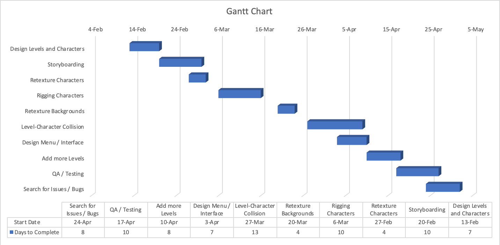

#  Software Development Plan

##  4.1 Plan Introduction
This Software Development Plan provides the details of the planned development of Tongue and Cheek, a bizarre 2D side scroller.

###  4.1.1 Project Deliverables

##  4.2 Project Resources

###  4.2.1 Hardware Resources
The following are the hardware resources used for development and execution of Tongue and Cheek:

| Category         | Requirement           |
| ---------------- | --------------------- |
| Processor        | 2.7 GHz Intel Core i5 |
| Hard Drive Space | 1 GB                  |
| RAM              | 4 GB                  |
| Display          | 1280×720, 256 colors  |
| Sound Card       | Optional              |

The exceptional RAM requirement is necessary to support the detailed sprite animation and graphical images. These graphical demands require a large amount of RAM. There will be limited sound functionality unless the user has a sound card.

###  4.2.2 Software Resources
The following are the software resources used for development and execution of Tongue and Cheek:

| Category         | Requirement               |
| ---------------- | ------------------------- |
| Operating System | macOS Mojave, Windows 10  |
| Compiler         | Unity; C++/C#             |
| Graphics         | Adobe Photoshop, Inkscape |

macOS Mojave or Windows 10 is required for this project. Because of the scope of the project, there will be no attempt to test the program under macOS Mojave or Windows 10. The program will be written in C++/C# using Unity. Adobe Photoshop and Inkscape will be used to produce the graphical images and sprites for the project.

##  4.3 Project Organization

##  4.4 Project Schedule

###  4.4.1 Gantt Chart

###  4.4.2 Task / Resource Table
