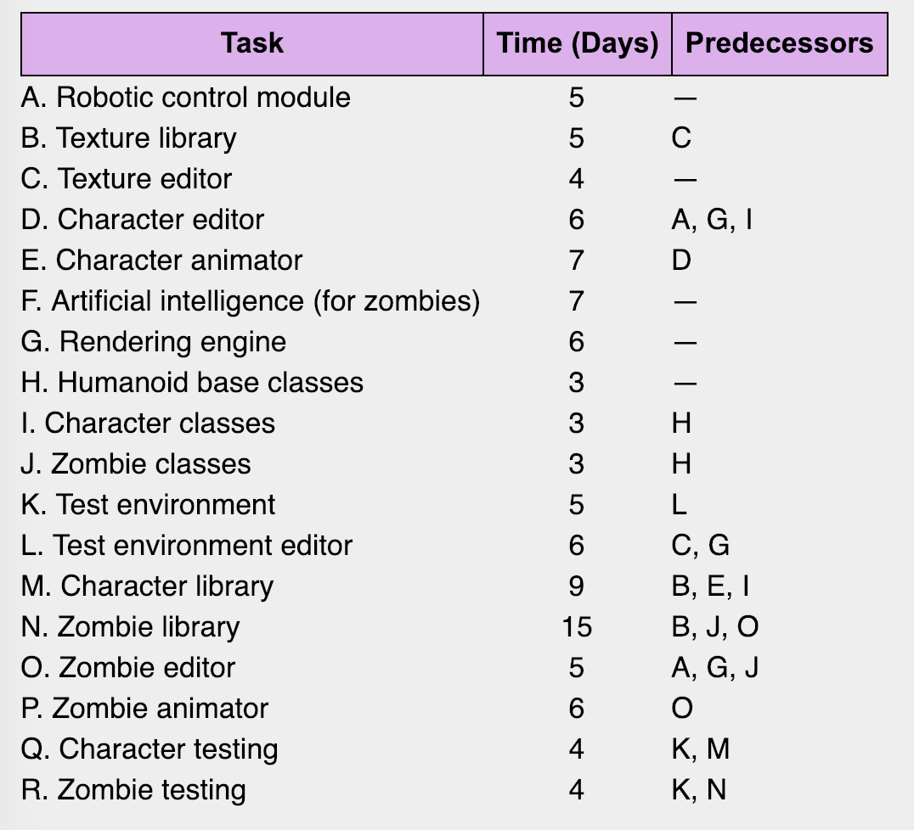
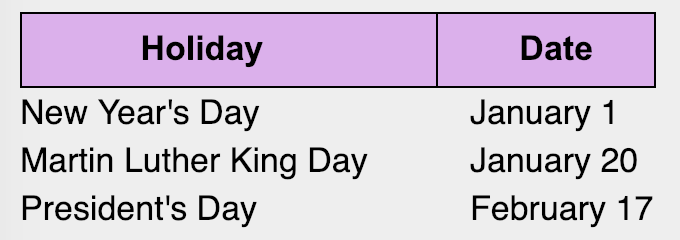
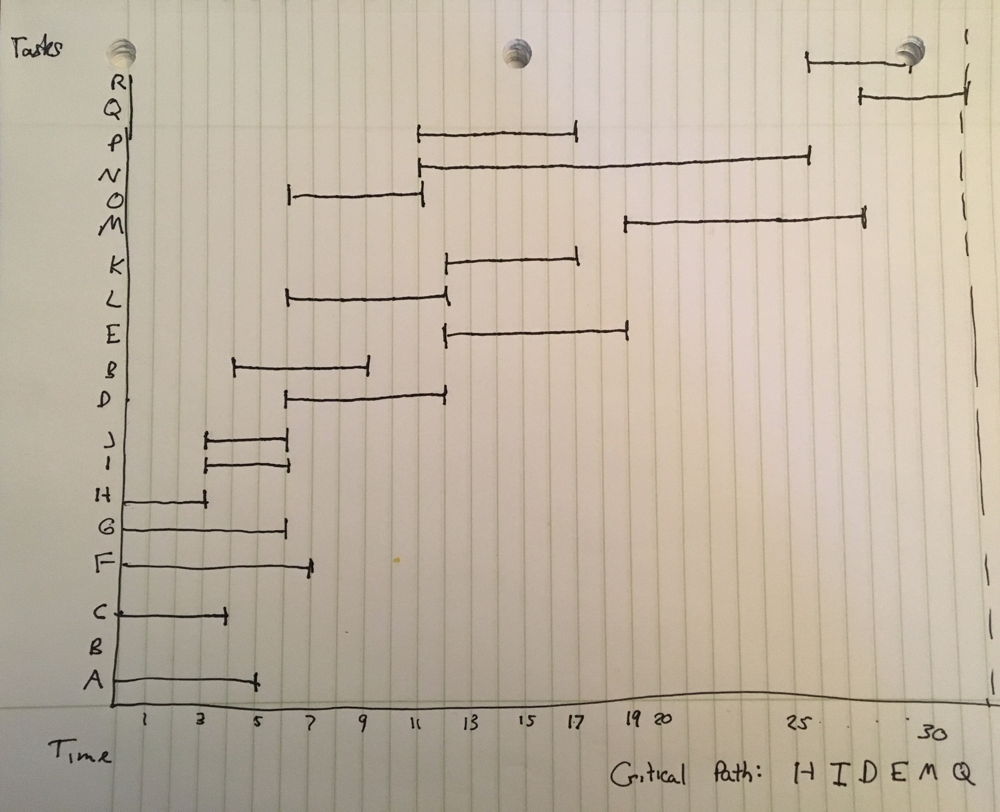
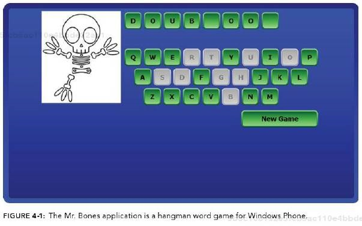

##  Problems from Ch 1 through 4
####  Sam Chami, Merci Magallanes, and John Scott

###  Problem 1.1, Stephens page 12

What are the basic tasks that all software engineering projects must handle?
>  Requirements gathering, high-level design, low-level design, development, and testing.

###  Problem 1.2, Stephens page 12

Give a one sentence description of each of the tasks you listed in Exercise 1.
>  *  **Requirements gathering** -- determining your or a client's wants and needs and turning them into agreed upon requirements documents
>  *  **High-level design** -- sorting out what technologies to use and general information about the project architecture
>  *  **Low-level design** -- details *how* the major pieces of the project should work sufficiently enough to guide developers to implement those pieces
>  *  **Development** -- implementing the refined low-level designs into code, testing it, and writing more code
>  *  **Testing** -- testing pieces of code and making sure everything works and if something doesn't then finding out what's wrong and fixing it

###  Problem 2.4, Stephens page 26

Like Microsoft Word, Google Docs [sic] provides some simple change tracking tools. Go to http://www.google.com/docs/about/ to learn more and sign up [if you do not have an account already]. Then create a document, save it, close it, reopen it, and make changes to it as you did in Exercise 1.
>  I created a document, saved it, closed it, reopened it, and make changes to it. I've used Google Docs for many documents and I find it interesting how Google Docs essentially contains all of the features Stephens says a good document management system should provide.

###  Problem 2.5, Stephens page 26

What does JBGE stand for and what does it mean?
>  JBGE stands for "just barely good enough" and it's a school of thought that's idea is if you provide too much documentation, you end up wasting a lot of time updating it as you make changes to the code.


**Use the following table of data for Exercises 3.2 and 3.4.**


###  Problem 3.2, Stephens page 51

Use critical path methods to find the total expected time from the project's start for each task's completion. Find the critical path. What are the tasks on the critical path? What is the total expected duration of the project in working days?
```
Critical Path: 32 days
Tasks on Path: H + I + D + E + M + Q
Time per Task: 3 + 3 + 6 + 7 + 9 + 4 = 32 days
```

###  Problem 3.4, Stephens page 51

Build a Gantt chart for the network you drew in Exercise 3. [Yes, I know, you weren't assigned that one — however, when you do Exercise 2 you should have enough information for this one.] Start on Wednesday, January 1, 2020, and don't work on weekends or the following holidays:

>  


###  Problem 3.6, Stephens page 51

In addition to losing time from vacation and sick leave, projects can suffer from problems that just strike out of nowhere. Sort of a bad version of deus ex machina. For example, senior management could decide to switch your target platform from Windows desktop PSs to the latest smartwatch technology. Or a strike in the Far East could delay the shipment of your new servers. Or one of your developers might move to Iceland. How can you handle these sorts of completely unpredictable problems?
>  Since unpredictable delays are inevitable in many CS projects, it's best to keep a live version of a Gantt chart. Also, your projected time should not reflect the project deadline. For example, it would be unrealistic to expect a company to launch an app in 45 days that they predict to take 45 days to create. There should always be room to account for unexpected issues and just general QA.

###  Problem 3.8, Stephens page 51

What are the two biggest mistakes you can make while tracking tasks?
>  1. Ignore a problem when it arises and hope you can make time for it later.
>  2. Piling extra developers on a task assuming it will reduce the time it takes to finish.

###  Problem 4.1, Stephens page 82

List five characteristics of good requirements.
>  Clear   
>  Unambiguous   
>  Consistent   
>  Prioritized   
>  Verifiable

###  Problem 4.3, Stephens page 82

Suppose you want to build a program called TimeShifter to upload and download files at scheduled times while you're on vacation. The following list shows some of the applications requirements.

*  a. Allow users to monitor uploads/downloads while away from the office.
*  b. Let the user specify website log-in parameters such as an Internet address, a port, a username, and a password.
*  c. Let the user specify upload/download parameters such a number of retries if there's a problem.
*  d. Let the user select an Internet location, a local file, and a time to perform the upload/download.
*  e. Let the user schedule uploads/downloads at any time.
*  f. Allow uploads/downloads to run at any time.
*  g. Make uploads/downloads transfer at least 8 Mbps.
*  h. Run uploads/downloads sequentially. Two cannot run at the same time.
*  i. If an upload/download is scheduled for a time when another is in progress, it waits until the other one finishes.
*  j. Perform schedule uploads/downloads.
*  k. Keep a log of all attempted uploads/downloads and whether the succeeded.
*  l. Let the user empty the log.
*  m. Display reports of upload/download attempts.
*  n. Let the user view the log reports on a remote device such as a phone.
*  o. Send an e-mail to an administrator if an upload/download fails more than its maximum retry number of times.
*  p. Send a text message to an administrator if an upload/download fails more than it's maximum retury umber of times.

For this exercise, list the audience-oriented categories for each requirement. Are there requirements in each category? [If not, state why not…]
> * a. User Requirement
> * b. User Requirement
> * c. User Requirement
> * d. User Requirement
> * e. User Requirement
> * f. Functional Requirement
> * g. Functional Requirement
> * h. Functional Requirement
> * i. Nonfunctional Requirement
> * j. Functional Requirement
> * k. Functional Requirement
> * l. User Requirement
> * m. Nonfunctional Requirement
> * n. Business Requirement
> * o. Business Requirement
> * p. Business Requirement

###  Problem 4.9, Stephens page 83-84

Figure 4-1 [below] shows the design for a simple hangman game that will run on smartphones. When you click the New Game button, the program picks a random mystery word from a large list and starts a new game. Then if you click a letter, either the letter is filled in where it appears in the mystery word, or a new piece of Mr. Bones's skeleton appears. In either case, the letter you clicked is grayed out so that you don't pick it again. If you guess all the letters in the mystery word, the game displays a message that says, "Congratulations, you won!" If you build Mr. Bones's complete skeleton, a message says, "Sorry, you lost."



Brainstorm this application and see if you can think of ways you might change it. Use the MOSCOW method to prioritize your changes.
* I must change the display of the game, going from landscape layout to a portrait mode layout in order to better fit the smartphone layout.
* I should change the color scheme to be easier to see the letters. Essentially different background color to contrast the letters and the background color.  
* I should change the button color to better illustrate the empty gaps between the words.
* I should add a button to allow the user to exit the playing page of the game and go to the 'Main Menu' of the game.
* I could change the skeleton to a better illustration of the skeleton.
* I could change the game by adding a timer to the game to make it more exciting.
* I could change the layout of the game, by having the hangman illustration in the top center of the page, with the possible selectable letters on the lower half of the screen, as if it is the keyboard.
* I could add a text box at the top of the app that displays the theme of the word in order to better help the player guess the word.
* I could remove the 'New Game' button and replace it with 'New word'.
* At the time, I won't add any animations when the player loses or wins the game.
* At the time, I won't add any background music as the player is playing the game.
